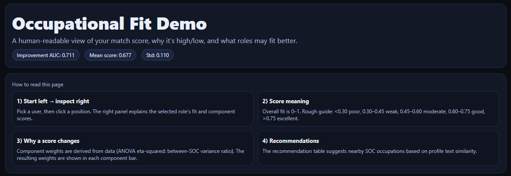
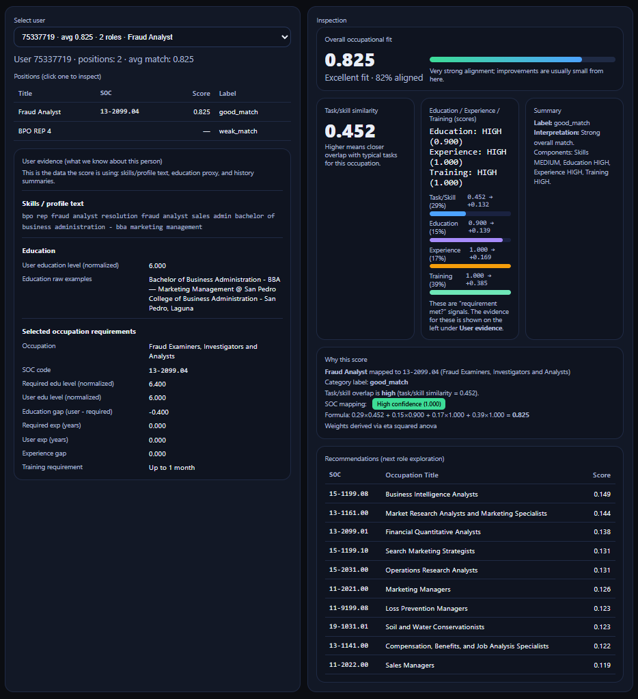
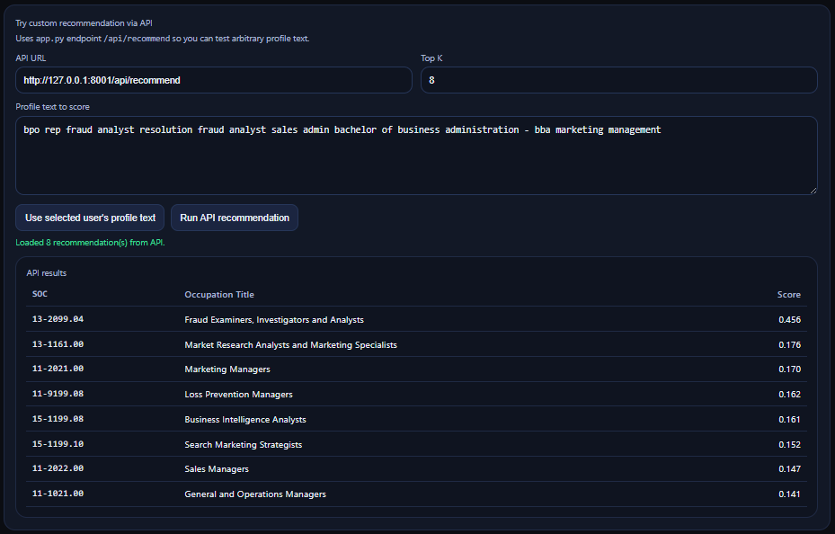

# Occupational Fit

**Estimating how well a worker fits a job.**

This project builds a composite *occupational fit score* by combining multiple signals about a worker and an occupation:

* **Task / skill similarity** — overlap between a worker’s profile text and O*NET task descriptions (TF-IDF character n-gram cosine similarity)
* **Education gap** — worker education level vs. typical education required by the occupation
* **Experience gap** — worker career experience vs. typical required experience
* **Training match** — proxy for training level vs. occupation training requirements

The final score is:

```math
\text{match\_score\_final} =
w_{\text{tfidf}} \cdot \text{tfidf}
+ w_{\text{edu}} \cdot \text{edu}
+ w_{\text{exp}} \cdot \text{exp}
+ w_{\text{train}} \cdot \text{train}
```


The weights are **learned from the data**, not chosen manually.
For each component we compute ANOVA eta-squared (η²), which measures how much variation in that feature is explained by occupation differences. Features that distinguish occupations better receive higher weight. The normalized weights are saved to `data/derived_weights.json`.

---

## Project Structure

```
├── data/
│   ├── final_job_match_dataset.csv
│   ├── artifacts/
│   └── sample_data_extracted/
├── notebooks/
│   ├── preprocessing.ipynb
│   ├── validation.ipynb
│   ├── predictive_model.ipynb
│   └── recommender.ipynb
├── demo/
│   ├── build_demo_artifacts.py
│   ├── app.py
│   └── index.html
├── requirements.txt
└── README.md
```

---

## Data Sources

| Source                              | Contents                               |
| ----------------------------------- | -------------------------------------- |
| `individual_position.csv`           | Work history (title, dates, seniority) |
| `individual_user_education.csv`     | Education records                      |
| `individual_user_skill.csv`         | Skills                                 |
| O*NET Task Ratings                  | Tasks and importance by occupation     |
| O*NET Education/Training/Experience | Typical requirements                   |
| O*NET Alternate Titles              | Real-world job title variants          |

---

## Pipeline Overview

### 1. Preprocessing (`preprocessing.ipynb`)

1. Extract and clean raw data
2. Normalize job titles
3. Map titles to SOC codes (exact → fuzzy → fallback)
4. Build occupation task documents
5. Compute TF-IDF similarity
6. Compute education gap
7. Compute experience and training gaps
8. Learn component weights using ANOVA η²
9. Combine into a composite fit score
10. Label match categories
11. Compute mapping confidence
12. Export `final_job_match_dataset.csv`

---

### 2. Validation (`validation.ipynb`)

Checks that the score behaves sensibly:

* recomputed score matches stored score
* exact matches score higher than fuzzy matches
* shuffle test destroys signal
* distribution and calibration checks
* component correlation analysis

---

### 3. Predictive Modeling (`predictive_model.ipynb`)

Tests whether the score predicts behavior:

* Random Forest (5-fold CV)
* occupation switch prediction
* match improvement prediction
* feature importance analysis
* career trajectory patterns

---

### 4. Recommender (`recommender.ipynb`)

Given a user profile:

* compute similarity to all occupations
* remove occupations already held
* return suggested alternatives
* explain using overlapping features

---

## Setup

```bash
pip install -r requirements.txt
```

Run preprocessing:

```
Open notebooks/preprocessing.ipynb and run all cells
```

Build demo data:

```bash
python demo/build_demo_artifacts.py
```

Start API:

```bash
python demo/app.py
```

Then open `demo/index.html` in a browser.

---

### Requirements

* Python 3.10+
* pandas
* numpy
* scikit-learn
* rapidfuzz
* openpyxl
* flask

---

## API Endpoints

| Method | Path             | Description                   |
| ------ | ---------------- | ----------------------------- |
| GET    | `/api/health`    | health check                  |
| POST   | `/api/recommend` | recommend occupations         |
| POST   | `/api/score`     | score text against occupation |
| GET    | `/api/user/<id>` | user evidence                 |

Example:

```bash
curl -X POST http://127.0.0.1:8001/api/score \
  -H "Content-Type: application/json" \
  -d '{"text": "data analysis python sql machine learning", "soc_code": "15-2051.00"}'
```

---

## Design Choices

**Character n-gram TF-IDF**
Handles abbreviations, spelling variation, and partial matches better than word tokens.

**Data-derived weights**
Avoids arbitrary weighting. Components that distinguish occupations more strongly get larger influence.

**Mapping confidence score**
Tracks reliability of job title → occupation mapping.

**Recommendation filtering**
Suggested occupations exclude roles the user has already held.

---

## UI Screenshots





## Limitations

* Job switch is a proxy outcome, not true voluntary exit
* Education mapping misses unusual credentials
* Training categories are coarse
* Non-English titles are harder to map
* Dataset size limits long-term career analysis

---

## Output Dataset

`final_job_match_dataset.csv` contains:

| Column                 | Description          |
| ---------------------- | -------------------- |
| `user_id`              | user identifier      |
| `position_id`          | position identifier  |
| `jobtitle_raw`         | original title       |
| `soc_code_final`       | mapped SOC           |
| `match_type`           | mapping type         |
| `match_score_final`    | final score          |
| `match_score_tfidf_v2` | similarity           |
| `edu_match_score`      | education            |
| `exp_match_score`      | experience           |
| `train_match_score`    | training             |
| `match_category`       | interpretation label |
| `mapping_confidence`   | SOC confidence       |
| `user_doc`             | profile text         |
| `soc_doc`              | occupation text      |

